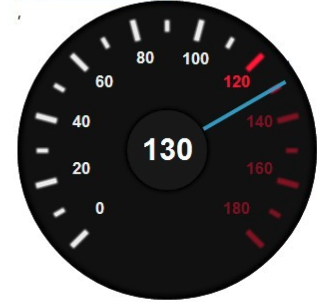

# \<SpeedOMeter />

Create `SpeedOMeter` component, that renders speedometer. Have scale from 0 to 180 km/hrs and one hand that shows current speed. Speed will be passed as `speed` prop.

Speedometer should change it's background to red when speed is above 120 km/hrs.

If `speed > 180` then speedometer should still show 180 km/hrs

## Expected use cases:

*Should render speed hand at zero:*
```
<SpeedOMeter speed={0} />
```

*Should render speed hand at 120 km/hrs and background will be red:*
```
<SpeedOMeter speed={120} />
```

*Should render speed hand at 180 km/hrs and background will be red:*
```
<SpeedOMeter speed={200} />
```
