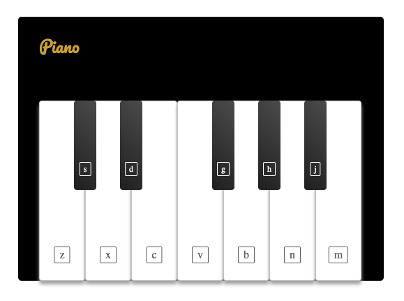

# \<PianoKeys />

Create `PianoKeys` component, that renders 12 piano keys (5 black and 7 ). It will have a prop called `pressedNow`. And it will expect to receive an array of pressed keys. For example `pressedNow={[ 'z', 'c', 'v' ]}`.

`pressedNow` array should reflected in your component. For example keys might be highlighted (darker background, for example).

## Expected use cases:

*Should render keys, but `z` and `v` highlighted:*
```
<PianoKeys pressedNow={[ 'z', 'v' ]} />
```


*Should render keys, but `z`, `v` and `j` highlighted:*
```
<PianoKeys pressedNow={[ 'z', 'v', 'j' ]} />
```

*Should render keys, but nothing is highlighted:*
```
<PianoKeys pressedNow={[]} />

<PianoKeys />
```


