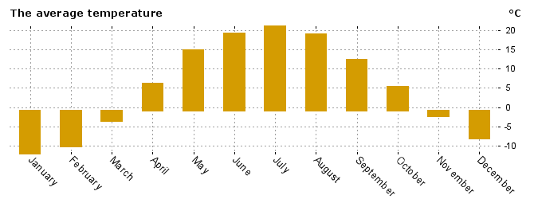

# \<AverageTemperatureChart />

Create `AverageTemperatureChart` component with simple bar chart using `<div>` elements and `flex`. Vertical scale is in range -50 - +50 degrees.

It should take array of values from `data` prop. And render actual chart.

## Expected use cases:

*Should render actual chart:*
```javascript

let yearlyData = [
    -12, // Jan
    -10, // Feb
     -5, // Mar
      5, // Apr
      8, // May
     20, // Jun
     33, // Jul
     26, // Aug
     10, // Sep
    -10, // Nov
    -26, // Dec
];

<AverageTemperatureChart data={yearlyData} />
```


## PS

Please. Do not over complicate this task. Think of `div` blocks and `flex`.